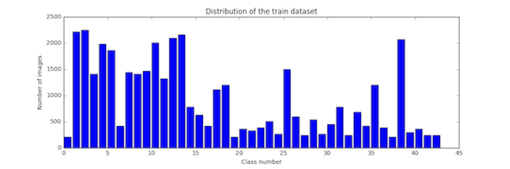
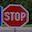
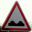
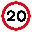

# **Traffic Sign Recognition** 

---

**Build a Traffic Sign Recognition Project**

The goals / steps of this project are the following:
* Load the data set (see below for links to the project data set)
* Explore, summarize and visualize the data set
* Design, train and test a model architecture
* Use the model to make predictions on new images
* Analyze the softmax probabilities of the new images

To refer to my project code, here is a link to my [project code](https://github.com/jainSamkit/German_traffic-sign-classifier/blob/master/Traffic_Sign_Classifier.ipynb)

### Data Set Summary & Exploration

#### 1.The dataset consist of approximately 39000 test images and 12630 training images with dimensions 32X32X3 in RGB color space,obviously! The link to the dataset is (http://benchmark.ini.rub.de/?section=gtsrb&subsection=dataset#Downloads).

I used the numpy library to calculate summary statistics of the traffic
signs data set:

* The size of training set is 39209
* The size of test set is 12630
* The shape of a traffic sign image is 32x32x3
* The number of unique classes/labels in the data set is 43

#### 2. I have provided a bar chart that shows the distribution of number of images belonging to different class.
Here is an exploratory visualization of the data set!

## Preprocessing and Normalization
Since ,the images in the dataset had three channels,the whole network was going to be complex.Threfore,to reduce the complexity ,conversion to grayscale seems the obvious choice.But ,conversion to grayscale prevents the network to learn the information abstracted in coloe channels.Threfore ,in cases where classification depends on colors,grayscale conversion should not perform at the state of art.In the dataset in this problem,I saw that the images in different class had different shapes and that their shapes according to me was a major crieteria for classification and it worked well further!.Therefore,I converted my images to grayscale.

Normalization of images also reduces the complexity of images and prevent them to overfit on the training data.I normalised my images between -1 and 1.

## Data Augmentation

Looking at the bar chart above,one can easily observe the discrepancy in the number of images per class ranging from mere 161 to 1799.Hence I added more data to the classes who had less than 800 images.As augmentation technique,I used random translation,scaling,rotation and warping.I also equalized the histograms of all channels.Data augmentation helped the network to generalise on the training data better and therefore also increased the performace of the network.

#### 2. I modified the pre-existing LeNet architecture to make it work on this data to perform better.The main difference in performance came from the dropout layer that I used before the fully connected layer.Please refer to the table below.

My final model consisted of the following layers:

| Layer         		|     Description	        					| 
|:---------------------:|:---------------------------------------------:| 
| Input         		| 32x32x1 Grayscale image   							| 
| Convolution 5x5(layer1)     	| 1x1 stride, same padding, outputs 28x28x6 	|
| RELU					|												|
| Max pooling	      	| 2x2 stride,  outputs 14x14x6 				|
| Convolution 5x5(layer2)	    | 1x1 stride, same padding, outputs 10x10x16 		|
| RELU					|												|
| Max pooling	      	| 2x2 stride,  outputs 5x5x16 				|
| Convolution 5x5(layer3)    | 1x1 stride, same padding, outputs 1x1x400 		|
| Flattening         | Flattened layer 2 and layer 3 ,outputs two arrays,1x400 each |
| Concatenation      | Concatenated flattened layer2 and layer3 |
| Dropout  | keep_prob:0.75 for training and 1.0 for test/validation |          
| Fully connected		| outputs scores of 43 classes |
 

### Hyperparameter Tuning

To train the model, I used the number of epochs to be 80 initially with the batch size of 100 and learning rate of 0.0009.I observed that the model was overfitting on the training dataset and that the improvement in the model seized after 40-50 epochs.Therefore ,I reduced the epochs to 50 and increased the batch size to 120.

#### Model Approach
At the very first,after I had done the necessary preprocessing and converted my images to grayscale ,I fed in the whole dataset in LeNet architecture.However,I saw that the accuracy on the test set didn't improve compared to the dataset without additional images.Therefore I modified the network and tuned the hyperparameters for model to learn better.The validation and test set accuracies are on tab 62 and 63 of my code respectively.

My final model results were:
* training set accuracy of 99.8
* validation set accuracy of 99.8
* test set accuracy of 94.6

Iterative approach:
* I chose the familiar LeNet architecture as I understood this network well and I was confident to play with this network.
* The LeNet architecture as found by me was overfitting everytime ,no matter how I augmented the data or whether I changed the size of my datset.
* Since,LeNet was overfitting ,I wanted to induce dropout.However,to apply dropout on any layer ,the architecture must be deep.For this ,I decided to change the last conv layer filter of LeNet from 5x5 to 1x1 .After this,I concatenated the conv2 layer and conv layer after flattening them.
* Dropout was then applied to this layer followed by the single fully connected layer.
 

### Test a Model on New Images

Here are five German traffic signs that I found on the web:

![Stop-Sign]  ![Bumpy Road]  ![Ahead Only]  
![No Vehicles]  ![Go straight or left]  ![General caution] 

#### The model performed optimally on the new images by classifying each of them correctly.I have also shown a visulaisation in my code at tab 116 to show the input and model's subsequent top 3 guesses.Please refer to the code.
Here are the results of the prediction:

| Image			        |     Prediction	        					| 
|:---------------------:|:---------------------------------------------:| 
| Ahead Only      		| Ahead only   									| 
| Stop-Sign     			| Stop-Sign 										|
| Bumpy Road					| Bumpy Road											|
| No Vehicles	      		| No Vehicles					 				|
| Go straight or left			| Go straight or left      							|
| General caution    | General caution|

The model was able to correctly guess 6 of the 6 traffic signs, which gives an accuracy of 100%. This compares favorably to the accuracy on the test set of 94.6 %.

#### In the tab 116 anf 119 ,I have provided the sofmax probabilities and visualisations of top 3 guesses made by my model 

The code for making predictions on my final model is located in the 104th cell of the Ipython notebook.

For the first image, the model is relatively sure that this is a Ahead-Only sign (probability of 1.0). The top three soft max probabilities were

| Probability         	|     Prediction	        					| 
|:---------------------:|:---------------------------------------------:| 
| 1.0         			|  Ahead only 									| 
| 0.0     				| Go straight or left 										|
| 0.0				| General Caution											|

For rest of the images please refer to my code at tab 116.

